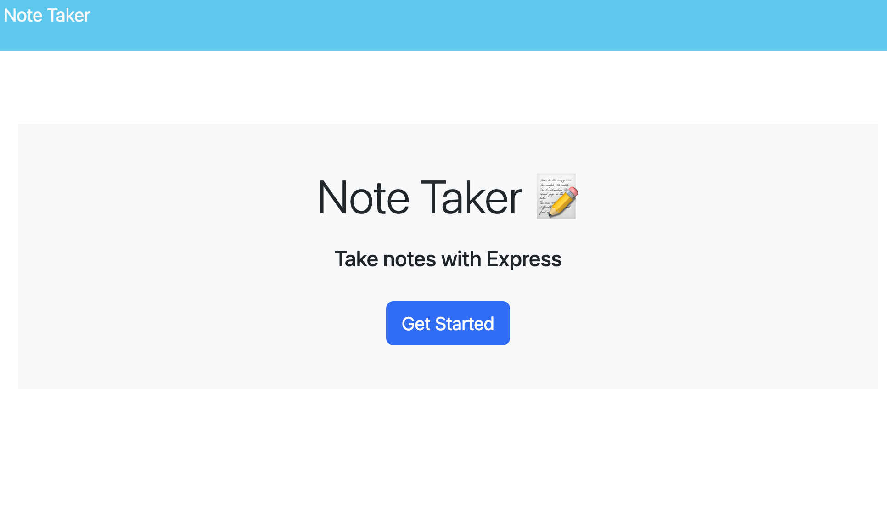
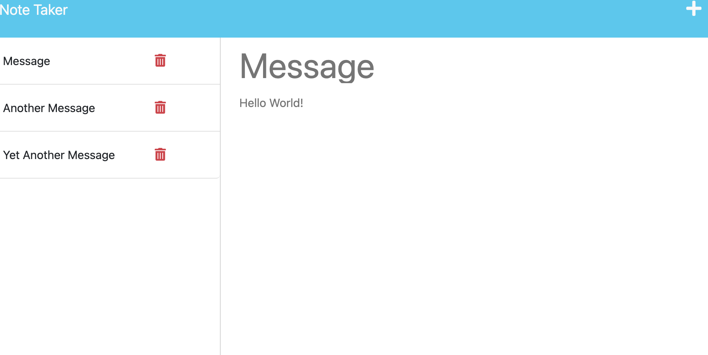

# 11 Express_Note_Taker

 

## Description

This project is a note taker project which utilized express.js in the backend following the CRUD acronym. The user can create a new note that will be saved, the note can also be deleted if the user wishes to delete the note. The most challenging part of this project was for me, creating routers using expresses ROUTER() method, but once I overcame that challenge it was a big relief and it helped me grow and actually understand why routing is used and how to use it with a deeper understanding. Another challenge that I faced was creating the functionality for the methods, but utilizing the resources I have at hand I got it and it taught me more was of going about handling javascript code.

## Table of Contents

- [Link](#link)
- [ScreenShot](#screenshot)
- [Installation](#installation)
- [Usage](#usage)
- [Credits](#credits)
- [License](#license)
- [Badges](#badges)
- [API](#api)

## Link
You can visit the deployed site by clicking the link below: 
[Express_Note_Taker](https://expressjs-note-taking.herokuapp.com/)

## ScreenShot

## Installation

No Installation needed, the app runs on the web.

## Usage

To use this abb just navigate to the provided link, then click the get started button which will take you to the notes page, on the note page you can add new notes and save the new note, when you enter a note a save button will appear in the top right corner that you can click to save the note to be added to the left of the screen with a list of all other notes if any. You can also delete any notes you no longer want or need, to do so just click on the red trashcan next to the note you want to delete. If you want to view a note just click on the note and you will see the note appear in the right, if you want to add another note you can also click the plus sign in the top right of the screen. Also if you would like to navigate back to the home page you can do so by clicking the word "Note Taker" in the top left of the screen.

## Credits

- Joshua V. Garcia

- [My GitHub Profile](https://github.com/garciajv86)

## License

 
This project is protected under the [MIT](https://choosealicense.com/licenses/mit/) License.

## Badges

 

 

## API

Express.js v4.16.4 is the package that was used for this project which enabled me to use the CRUD approach to handle request from the client and handle the data and data base in the backend.

- [Express.js Docs](https://expressjs.com/en/api.html)
